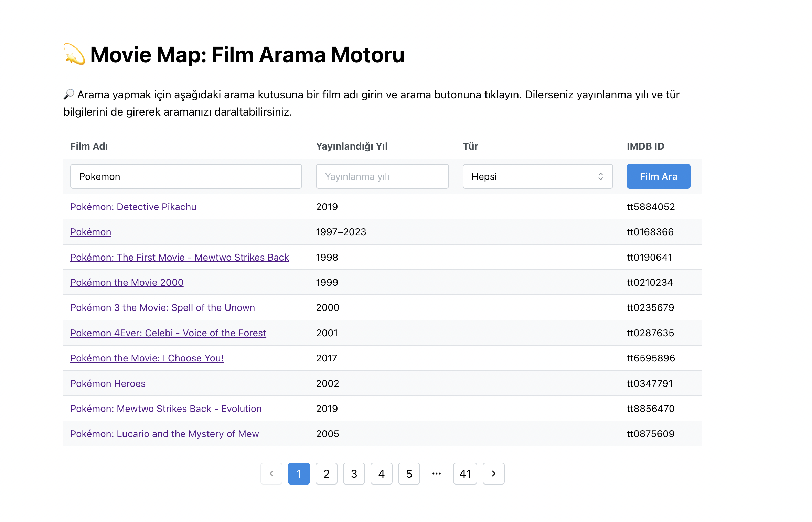
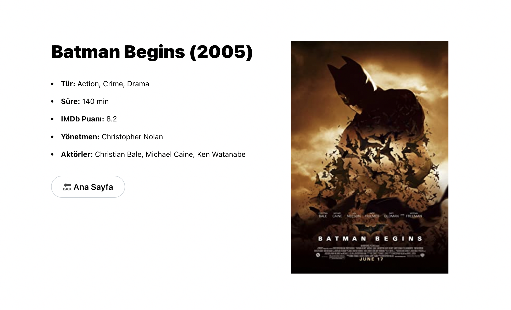

# Movie App with Redux Toolkit




## Proje Açıklaması

Bu proje, React ve Redux Toolkit kullanılarak geliştirilmiş bir film arama uygulamasını içerir. OMDb API'sini kullanarak film bilgilerini arayabilir ve detaylarını görüntüleyebilirsiniz. UI lib olarak MantineUI kullanılmıştır.

**Teknolojiler:** React, Redux Toolkit, React Router 6, Mantine UI

**Demo:** [Canlı Demo](https://movie-app-reduxtk-omdb.vercel.app/)

## Kurulum

Projeyi çalıştırmak için aşağıdaki adımları izleyin:

1. Bu projeyi klonlayın.
   ```bash
   git clone https://github.com/mfcandan/movie-app-reduxtk-omdb.git

2. Proje klasörüne gidin.
    ```bash
    cd proje-adiniz

3. Node Modüllerini yükleyin.
    ```bash
    npm install

4. .env_sample dosyasının adını .env olarak değiştirin ve API anahtarınızı ekleyin.

5. Projeyi başlatın
    ```bash
    npm start

6. Tarayıcınızda http://localhost:3000 adresinde çalışacaktır.
